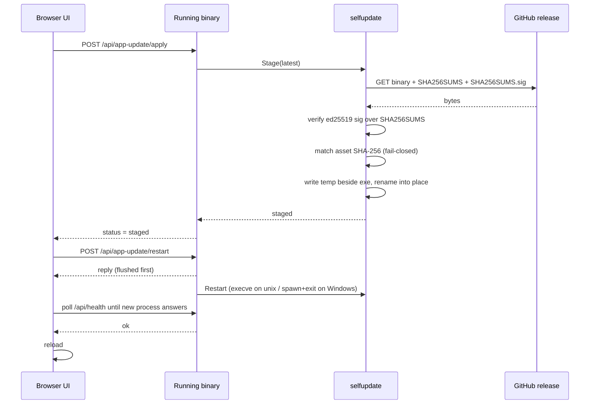

# Architecture

ModelsDB's design and internals. For setup, usage, and the query API, see [README.md](README.md).

## Overview

All model data lives in a single **SQLite** database (`data/modelsdb.db`). Each model exists once, keyed by `name`. One row holds everything: OpenRouter metadata, HuggingFace/collection metadata, derived capabilities, and your curated fields. The OpenRouter refresh updates the metadata columns. It never clobbers curated fields or collection-derived capabilities.

## Backend (Go)

### Dependencies

The Go standard library plus the pure-Go SQLite driver `modernc.org/sqlite`. There is no cgo, so cross-compilation still works.

### Self-contained binary

`index.html` and everything under `internal/app/static/` are compiled into the executable via `//go:embed`. A single binary serves the whole UI. There are no loose web assets to ship. The UI (`index.html` and the `/static/` files) is served with `Cache-Control: no-cache`, because embedded files have a zero modification time and so carry no cache validator; without that header a browser could keep serving a cached `app.js`/`style.css` after the binary is updated. The assets are tiny and local, so revalidating on every load costs nothing and guarantees an update shows up on the next reload.

### Path resolution (`paths.go`)

The app keeps three separate directories: **config**, **data**, and **cache**. Each is resolved at startup by a per-directory cascade, where the first hit wins:

1. A CLI flag (`--config-dir` / `--data-dir` / `--cache-dir`).
2. An env var (`MODELSDB_CONFIG_DIR` / `MODELSDB_DATA_DIR` / `MODELSDB_CACHE_DIR`).
3. A `config.jsonc` (or legacy `config.json`) next to the exe (**portable mode**).
4. A `config.jsonc` (or legacy `config.json`) in the OS config dir.
5. The OS-standard default.

The defaults are `os.UserConfigDir()/modelsdb` (config), the platform data dir (`%LOCALAPPDATA%\modelsdb\data`, `$XDG_DATA_HOME/modelsdb`, `~/Library/Application Support/modelsdb`), and `os.UserCacheDir()/modelsdb` (cache). The directory leaf is the lowercase `modelsdb` (`appName` in `internal/paths/config.go`); the product name **ModelsDB** appears only in the UI and docs, never as a folder name. On a case-sensitive filesystem (Linux) an install that earlier created a capitalized `ModelsDB` directory would be orphaned by this, so on startup `migrateLegacyDir` renames each such directory to its lowercase twin **once** - only when the lowercase directory does not already exist. On a case-insensitive filesystem (Windows/macOS) the two names are the same directory, so nothing is renamed.

On a first run with no config file, a `config.jsonc` is written into the config dir so the locations are remembered. Running via `go run` (a temp/`go-build` exe) **defaults** config/data/cache to `./data` and never writes a config file, so the maintainer's `curated.json` round-trips. An explicit override still wins in dev: a `--config-dir`/`--data-dir`/`--cache-dir` flag or a `MODELSDB_*_DIR` env var sets a dir directly, and when the config dir holds a `config.jsonc` its `data_dir`/`cache_dir`/`port` apply (relative paths resolve from that config dir). The dev wrappers use this: `./start_dev.sh` runs pure source on `./data` at port 8123, and `./start_dev_binary.sh` runs the built `./dist/modelsdb` with all three dir flags pinned to `./data` at port 8124 (the pinned `--cache-dir` is what keeps its PID file out of the production cache, so its single-instance takeover cannot touch a production server). Startup work (path resolution, then DB open and migrate, then seed) runs in an explicit `bootstrap()` called from `Run()`, after the global flags are parsed.

### Single instance, one port per run

On startup the app stops any previously running instance (tracked by a PID file in the cache dir) and binds its port. The default is 8122. It is configurable via the same cascade as the directories: the `config.jsonc` `"port"` value, the `--port` flag, or `MODELSDB_PORT`. Two servers never run at once, because they would contend over the SQLite DB. If the port is held by a different (foreign) process, the app exits with a clear error instead of moving to another port.

**Process control.** Beyond the default server run, the binary manages its own background lifecycle so no external scripts are needed. `Run` (in `internal/app/cli.go`) dispatches: `serve` (force the foreground server), `start` (spawn a detached background server and return), `stop` (stop the running server), and `status` (report running state and bound addresses). Before any of that it handles the informational flags: `--help`/`-h` (or the bare `help` word) prints the usage and exits 0, and `--version`/`-v` prints `shared.Version` and exits 0 — both run *before* path resolution, so they touch no directory and take over no running instance. `ParseGlobalFlags` (in `internal/paths/paths.go`) also returns any dash-prefixed token it does not recognize as an **unknown** flag; `Run` rejects a non-empty command it cannot match and any unknown flag with a "try --help" error and a non-zero exit, instead of falling through to start a server on the default directories (which would take over the running instance). With no subcommand it shows an interactive menu when standard input is a terminal (detected with `go-isatty`), and starts the server directly otherwise — so services, pipes, and `nohup` are unaffected; `build.sh` relaunches with `serve` for the same reason. Background start (`internal/app/control.go`) re-executes the binary as `serve`, detached via a platform `SysProcAttr` (`spawn_unix.go` uses `Setsid`; `spawn_windows.go` uses `DETACHED_PROCESS | CREATE_NO_WINDOW | CREATE_NEW_PROCESS_GROUP`), forwarding the same global dir/port/host flags (`paths.GlobalFlagArgs`); the child writes the PID file as any server does. `stop` uses the bound port as the "is it running" signal and the PID file to know which process to end. These control commands resolve paths quietly (no log file or startup banner); only the server and the data subcommands wire the rotating log.

The menu can also **put `modelsdb` on PATH** (`internal/app/pathinstall.go` + platform files). On Linux/macOS it offers a symlink into `~/.local/bin` or a PATH entry appended to the shell rc chosen from `$SHELL` (`~/.bashrc` / `~/.zshrc` / `~/.profile`); on Windows it appends the binary's folder to the per-user `Path` in the registry (`HKCU\Environment`). The two Unix methods are mutually exclusive (installing one removes the other) and only ever touch artifacts the app created: a marker-fenced block in the rc file, the exact `~/.local/bin/modelsdb` symlink, or the binary's own folder in the Windows user Path - never a user's own entry. The text helpers (rc-block add/remove, PATH-list add/remove) are pure and unit-tested on every platform; only the file/registry I/O is platform-specific.

The **bind address** resolves with the same first-hit-wins cascade: `--host` flag > `MODELSDB_HOST` env > `config.jsonc` `"host"` > default `127.0.0.1`. A `host` of `"tailscale"` (case-insensitive) is a **sentinel**: `resolveHost` finds this machine's first IPv4 in the Tailscale/CGNAT range `100.64.0.0/10` and binds that; if none is present (Tailscale down or not installed) it logs a warning and falls back to loopback. The app **always binds loopback** (so local tooling and the single-instance port probe in `single_instance.go`, which listens on `127.0.0.1:<port>`, keep working) and, when `host` is a specific non-loopback address (e.g. a Tailscale `100.x` IP), binds that as a **second** listener sharing the same handler. A wildcard host (`0.0.0.0` / `::`) already covers loopback, so it binds alone. The loopback (primary) listener is required — a bind failure there is fatal — while an extra listener that cannot bind (interface down, address not local) is a logged warning and local serving continues. `bindAddrs` in `internal/app/server.go` computes the address set.

There is **no authentication**, so any non-loopback bind exposes full read/write — including `/api/save`, `/api/update`, and the self-update endpoints — to anyone who can route to that address. To stop that happening by accident, the server **refuses to bind a public or wildcard address**: at the top of `StartServer`, `paths.BindExposure(host)` classifies the resolved host as `loopback`, `private`, `tailscale`, `wildcard`, or `public` (loopback / RFC 1918 / link-local / unique-local / `100.64.0.0/10` are safe; a hostname is resolved and counts as public unless every address is safe), and a `wildcard` or `public` result is fatal unless `AllowPublic` is set. `AllowPublic` follows the same cascade: `--allow-public` flag > `MODELSDB_ALLOW_PUBLIC` env (truthy) > `config.jsonc` `"allow_public"` > `false`. The flag is forwarded to a spawned background server (`paths.GlobalFlagArgs`) so the guard is consistent across `start`/`serve`.

### Resilient startup

The catalog is refreshed on every startup. If the fetch fails (network down, upstream API change), the server logs a warning and keeps serving the existing data instead of crashing.

### Schema migrations and backups (`migrate.go`)

The schema version is tracked in SQLite's `PRAGMA user_version`. On open, every registered migration above the DB's version is applied in order. Because shipped binaries evolve a stranger's database, the path is conservative:

- A non-empty DB is fully **backed up** to `data/.backups/` first (WAL-checkpointed; retention capped at `MaxBackupsToKeep`).
- Each migration runs in a transaction.
- `PRAGMA integrity_check` must pass afterward.
- On ANY failure the pre-migration backup is **auto-restored** and the app exits with a clear message.

Two CLI verbs round out recovery: `backups` lists the snapshots, and `restore <file>` rolls back, snapshotting the current DB first.

### Visible errors and logging

All server output is written to `<cache>/logs/modelsdb.log`, in addition to the console, so errors survive even if the window closes. On a fatal error in an interactive console (for example a double-clicked exe) the app prints the error and waits for Enter before exiting, so you can read it. When run from a script or pipe it exits immediately and never hangs automation.

### One source of truth, one public export

The binary `modelsdb.db` is the **single source of truth for ALL model data, objective AND personal** (`notes, speed, rating, favorite, ocr_quality`). It is git-ignored, because it is binary and it holds your personal data.

On a save or refresh the app exports ONE file, `curated.json` (git-**tracked**). The app never runs git itself, so committing it is up to you. This file holds the OBJECTIVE subset, wrapped in a small schema header (`{schema_version, min_app_version, models:[...]}`). The subset is the objective curated facts (`tool, moe, parameters, active_parameters, disk_size_gb, measurement, pricing_note`) plus the identity/metadata of non-API models. It is the portable public catalog that a fresh clone rebuilds an EMPTY DB from. An older binary refuses to import a catalog whose `min_app_version` exceeds its build.

A model flagged **`unlisted`** is kept in the DB but withheld from this export (`CuratedBytes` skips it), so a maintainer's private or experimental hand-added models are not published to the public repo. Like personal data, an unlisted model lives only in the DB and its durable backup, not in `curated.json`.

**Personal data is never written to a file**, so it is never published. You back it up by copying `modelsdb.db`.

### The DB is authoritative; startup never overwrites `curated.json` (`seed.go`)

`curated.json` is the rebuild source ONLY for an empty DB. On a populated DB it is a one-way export, so a `curated.json` you restore onto a populated DB is NOT auto-imported. The DB wins.

To roll back, replace `modelsdb.db` (it is migrated forward on open by `migrate.go`), or clear it and restart so the seed rebuilds from `curated.json`. The `min_app_version` gate applies on that seed: an older build refuses a newer catalog and leaves the DB intact. The rule is migrate forward, never wipe.

The automatic startup fetch refreshes the DB but does NOT export. `curated.json` is rewritten only by a real data change: an in-app save via `/api/save`, or a user-run update (the **Update models** button or the `update` / `collections` / `pricing` CLI). `ExportMissing` creates it only if it is absent. There is no `personal.json`. Personal data is never exported.

### Fresh-install seed (`internal/seedcatalog`)

A fresh install seeds itself **offline from a catalog embedded in the binary** (`internal/seedcatalog`, `//go:embed catalog.json`). On an empty DB with no local `curated.json`, `EnsureSeeded` imports the embedded copy (`store.ImportCuratedBytes`) - no network, no prompt - and the startup OpenRouter refresh then updates the live models. There is **no remote catalog fetch and no first-run setup screen**. If a build ever ships without an embedded catalog and no local `curated.json` is present, the DB simply starts empty and the startup fetch populates it.

**Publishing a new catalog:** the embedded file is the published seed. Regenerate it from the maintainer's database with `modelsdb export internal/seedcatalog/catalog.json` (the `export` command writes the objective catalog with personal data and `unlisted` models excluded), commit it, and build the release. `data/curated.json` is kept in sync as the human-readable, git-tracked copy.

### Update check (`updatecheck.go`, `/api/update-check`)

On startup and daily, the app compares its injected version to the upstream repo's latest GitHub release. If a newer one exists, it surfaces a dismissible download banner. It is **notify-only**. It never downloads or replaces the binary. The last result is cached in the cache dir. A **Check for updates** button in the Info dialog forces an immediate check via `GET /api/update-check?force=1`, which hits GitHub synchronously (bypassing the daily throttle) and returns the fresh result.

### Binary self-update (`internal/selfupdate`, `appupdate.go`, `/api/app-update/*`)

Separately from the notify-only check, a shipped binary can replace **itself** with a newer release. This is distinct from `/api/update` (which refreshes model DATA); self-update replaces the executable FILE. It is available only on the platforms the release publishes (linux/amd64, windows/amd64); on anything else `selfupdate.Supported()` is false and only the notify banner shows.

The trust model is **fail-closed and signature-based**. The release publishes, per platform, the binary plus a `SHA256SUMS` file and a detached `SHA256SUMS.sig` (an ed25519 signature over the checksums bytes, produced in CI by `cmd/sign` from the `MODELSDB_SIGN_KEY` secret). Before any swap, the app verifies that signature against the ed25519 **public key embedded in the binary** (`internal/selfupdate/pubkey.go`), then matches the downloaded asset's SHA-256 against its line in `SHA256SUMS`. A missing/invalid signature, a missing sig/sums asset, or a hash mismatch aborts the update and leaves the running binary untouched. There is no unsigned path. When the embedded key is still the placeholder, staging refuses with "release signing key not configured".

The **swap is atomic and OS-split**. The verified bytes are written to a temp file in the SAME directory as the running exe (same filesystem, so `rename` is atomic). On unix (`apply_unix.go`) a single `os.Rename(temp, self)` replaces the running executable, and `Restart` re-execs in place with `syscall.Exec`. On Windows (`apply_windows.go`) the running `.exe` cannot be overwritten but CAN be renamed, so the old file is moved to `<exe>.old`, the temp file is renamed into place, and `Restart` starts a fresh process then exits. `CleanupOnStartup` (a no-op on unix) removes the leftover `<exe>.old`: it tries at startup and, because the just-exited old process may still briefly hold that file, retries in the background; if it still cannot delete it, a subsequent startup - once the old process is fully gone - removes it.

On the server path, the single-instance takeover (`KillPreviousInstance`) runs BEFORE the DB is opened, so a Windows restart never opens or migrates `modelsdb.db` while the old process still holds it. It waits for the port **the recorded instance held**, which is read from the PID file rather than assumed to be this process's port - the wait exists to prove the DB was released, and waiting on a port the dying process never held would return at once and prove nothing.

The controller (`appupdate.go`) is a small mutex-guarded state machine: `idle -> downloading -> verifying -> staged` (or `failed`), mirroring `updatecheck.go`'s style. Staging can be triggered by `POST /api/app-update/apply` (manual) or, when the user opts in via the `auto_update` setting, automatically by the daily check. Either way it stops at `staged`; the restart that applies it is always an explicit `POST /api/app-update/restart`. The restart handler flushes its reply before re-launching (the re-exec would otherwise drop the response), and the UI polls `/api/health` until the new process answers, then reloads.



### Configurable upstream

The GitHub repo used for the remote seed and the update check is configurable, so a fork pulls its own catalog and updates. It is resolved in this order:

1. The env vars `MODELSDB_UPSTREAM_OWNER`, `MODELSDB_UPSTREAM_REPO`, and `MODELSDB_UPSTREAM_BRANCH`. These are a per-run override and take precedence over `config.jsonc`.
2. The `config.jsonc` `upstream{owner,repo,branch}` block.
3. The default, `DavidTimar1/ModelsDB@main`.

Requests to GitHub send only Go's default User-Agent. They carry no app or owner identity.

### Versioning

The app version is injected at build time from the repo-root `VERSION` file (`-X 'modelsdb/internal/shared.Version=...'`). `build.sh` injects the bare version (`1.26.1`); the dev wrappers `start_dev.sh` and `start_dev_agent.sh` inject it with a `-dev` suffix (`1.26.1-dev`), so a dev server names the version it is built from without claiming to be that release - which matters when a dev and a production server are open side by side. A bare `go run` with no ldflags falls back to `dev` and has no number to show. `shared.IsDevVersion()` is true for `dev` and for any `-dev` suffix, and skips the version gate, the update nag and the self-updater; `parseSemver` already ignores a `-suffix`, so comparisons are unaffected. The header shows whatever the build reports, verbatim.

### Cross-compilation

`build.sh` emits a Windows (`modelsdb.exe`) and a Linux (`modelsdb`) binary. It bakes in only the version, never machine paths.

## Frontend

The web UI is an embedded jQuery + DataTables single-page table with inline editing, debounced autosave, and a persisted filter bar. It is documented in [DESIGN.md](DESIGN.md).

## Data model

The DB column groups, on the single `models` table:

- **Identity/metadata** (refreshed from OpenRouter): `id, slug, hf_slug, author, description, context_length, input_modalities, output_modalities, supports_reasoning, price_* (incl. price_display + pricing_url for page-scraped pricing), model_type, source`.
- **Capabilities:** `model_type` (chat/image/video/embedding/rerank/tts/stt), modalities, and `collections` (which OpenRouter collections the model belongs to). Modalities are UNIONed on refresh, so collection-derived capabilities are never lost.
- **ZDR (Zero Data Retention)** `zdr`: a boolean that mirrors OpenRouter's website "Zero Data Retention" filter. A model is `zdr = true` if ANY of its serving providers keeps no prompts (`dataPolicy.retainsPrompts == false`). Non-OpenRouter models (`huggingface` / `collection` / `manual`) are always `zdr = true` by rule. See [ZDR derivation](#zdr-derivation) below.
- **Curated** (never auto-overwritten), split by where it is exported:
  - *Objective* (public, in `curated.json`): `tool, moe, parameters, active_parameters, disk_size_gb, measurement, pricing_note`. `disk_size_gb` is the total size in GB of the model's native-precision weight files (safetensors / `.bin`) on the canonical HuggingFace repo's main revision (excludes quantized/GGUF mirrors and non-weight files); the UI shows it (rounded up to a whole number) in the read-only "Size (GB)" column. `measurement` is the pricing unit for the In/Out $ columns (e.g. `per 1M tokens`, `per second`, `per image`) and is filterable in the UI. `pricing_note` records objective pricing caveats (extra SKUs the In/Out columns omit).
  - *Personal* (private, stored ONLY in the DB and never exported to any file): `notes, speed, rating, favorite, ocr_quality`.

`source` is `openrouter` (from the API), `huggingface` (manual HF records), or `collection` (models discovered on collection pages that the API omits).

## Directory structure

The Go code follows the standard `cmd/` + `internal/` layout. `internal/` is
split into six packages by responsibility, wired as a strict dependency DAG
(each package imports only packages ABOVE it in this list - no cycles):

| Package            | Imports (internal)            | Responsibility |
|--------------------|-------------------------------|----------------|
| `internal/paths`   | (none)                        | config/data/cache dir + port resolution cascade, `config.jsonc`, per-fork upstream |
| `internal/shared`  | paths                         | low-level helpers: JSON field extractors, version/semver + curated schema consts, fatal-error handling, log rotation, single-instance lock |
| `internal/dbcore`  | paths, shared                 | SQLite connection + base schema, value helpers, versioned backed-up migrations, backup/restore |
| `internal/store`   | paths, shared, dbcore         | model CRUD, curated/personal columns, capability enrichment, `curated.json` export (objective only), DB seeding (local `curated.json` / embedded catalog) + min-version gate |
| `internal/catalog` | paths, shared, dbcore, store  | ALL upstream-schema knowledge: OpenRouter fetch+normalize, collection scraping, page-pricing scraping, ZDR derivation, upstream GitHub fetch/seed |
| `internal/selfupdate` | paths, shared              | in-app binary self-update: download + signature/hash verify (fail-closed) + OS-split in-place swap + re-launch |
| `internal/app`     | all of the above              | top layer: HTTP server + routes + embedded UI, JSON handlers, query API, background refresh controller, update-check, self-update controller, CLI dispatch (`Run`) |

`internal/selfupdate` sits beside `dbcore`/`store`/`catalog` in the DAG: it depends only on `paths` and `shared`, and `app` depends on it. It has no knowledge of the DB or the catalog - it swaps the executable file, nothing more.

The build-time `Version` var lives in `internal/shared` (so the ldflag path is
`-X 'modelsdb/internal/shared.Version=...'`).

```text
ModelsDB/
├── cmd/
│   ├── modelsdb/
│   │   └── main.go        # Entry point (package main; calls app.Run)
│   └── sign/
│       └── main.go        # Maintainer/CI signing helper (keygen + sums); NOT shipped
├── internal/
│   ├── paths/             # Lowest level: imported by ~everything
│   │   ├── config.go      # Port, app name, resolved path vars, tunables
│   │   └── paths.go       # config/data/cache resolution cascade + config.jsonc + upstream + FileExists
│   ├── shared/            # Low-level helpers (imports paths)
│   │   ├── utils.go       # JSON field helpers (GetStr/GetBool/GetNum)
│   │   ├── version.go     # Injected Version + semver helpers + curated schema constants
│   │   ├── fatal.go       # Fatal/Fatalf + panic recovery (keep errors visible)
│   │   ├── logrotate.go   # Size-rotating log writer
│   │   └── single_instance.go # PID-file single-instance lock (per data dir) + port-in-use check
│   ├── dbcore/            # SQLite layer (imports paths, shared)
│   │   ├── db.go          # Connection + base schema (openConn/OpenDB) + value helpers
│   │   └── migrate.go     # PRAGMA user_version migrations, pre-migration backup/restore/integrity
│   ├── store/             # Data layer (imports paths, shared, dbcore)
│   │   ├── store.go       # Upserts, curated updates, capability enrichment, export
│   │   └── seed.go        # Seeds an empty DB from curated.json or the embedded catalog (+ min-version gate)
│   ├── catalog/           # Upstream-schema knowledge (imports paths, shared, dbcore, store)
│   │   ├── update.go      # OpenRouter fetch + NormalizeModel + upsert
│   │   ├── collections.go # Scrape OpenRouter collections; enrich + add missing models
│   │   ├── pricing.go     # Scrape per-model pricing from model pages (API-absent models)
│   │   ├── zdr.go         # Derive each model's Zero Data Retention flag
│   │   └── remote.go      # Update-check HTTP helpers (default UA): httpGetBytes, HTTPGetJSON
│   ├── selfupdate/        # In-app binary self-update (imports paths, shared)
│   │   ├── selfupdate.go  # Stage(): download -> verify -> swap; package doc
│   │   ├── assets.go      # GOOS/GOARCH -> asset name; Supported()
│   │   ├── pubkey.go      # embedded ed25519 public key (placeholder until keygen)
│   │   ├── verify.go      # ed25519 sig over SHA256SUMS + asset SHA-256 match (fail-closed)
│   │   ├── download.go    # fetch asset to a temp file beside the exe (default UA)
│   │   ├── apply_unix.go / apply_windows.go     # OS-split in-place swap
│   │   ├── restart_unix.go / restart_windows.go # OS-split re-launch
│   │   └── cleanup.go / cleanup_windows.go      # remove leftover <exe>.old (Windows)
│   └── app/               # Top layer: HTTP + CLI (imports all of the above)
│       ├── cli.go         # Run: global flags -> control command / data subcommand / menu / server
│       ├── control.go     # Process control: interactive menu + start/stop/status/update helpers
│       ├── spawn_unix.go  # Detach attributes for a background child (Setsid)
│       ├── spawn_windows.go # Detach attributes for a background child (DETACHED_PROCESS ...)
│       ├── pathinstall.go # "Add to PATH" submenu + pure rc-block / PATH-list helpers
│       ├── pathinstall_unix.go    # symlink into ~/.local/bin; shell-rc PATH edit
│       ├── pathinstall_windows.go # per-user PATH via registry (HKCU\Environment)
│       ├── server.go      # HTTP server, routes, embedded assets, bindAddrs, StartServer
│       ├── handlers.go    # /api/models, /api/save, /api/settings, /api/health, /api/update[/status], /api/update-check, /api/app-update/*
│       ├── query.go       # Query/filter API + the /api markdown usage guide
│       ├── process.go     # Build the display rows from the DB
│       ├── refresh.go     # On-demand full-refresh controller (single-flight guard + status)
│       ├── updatecheck.go # Notify-only GitHub release check + cache (+ auto-stage opt-in)
│       ├── appupdate.go   # Self-update controller: staging state machine + auto opt-in
│       ├── index.html     # Single-page frontend (embedded)
│       └── static/        # CSS/JS assets: DataTables, jQuery, Select2 (embedded)
├── <config dir>/          # OS config dir (or ./data in dev, or portable exe dir)
│   ├── config.jsonc       # Path pointers + port + upstream + first-run state (JSONC: comments allowed)
│   └── settings.json      # UI settings (git-ignored)
├── <data dir>/            # OS data dir (or ./data in dev)
│   ├── modelsdb.db        # SQLite source of truth (git-ignored)
│   ├── curated.json       # Public objective export (git-tracked; you commit it)
│   └── .backups/          # Pre-migration DB snapshots (git-ignored)
├── <cache dir>/           # OS cache dir (or ./data in dev)
│   ├── logs/modelsdb.log  # size-rotated, ~2 MB x 4 max
│   ├── modelsdb.pid       # Running instance: {"pid","port","exe"} as JSON
│   └── update-check.json  # Cached update-check result
├── dist/                  # Build output (git-ignored): modelsdb.exe, modelsdb
├── build.sh               # Cross-compilation build script (injects VERSION)
├── VERSION                # Single source of the app version
└── go.mod                 # Module: modelsdb (Go 1.26+)
```

In a `go run` development checkout the three directories all collapse onto `./data` by default (already git-ignored except `curated.json`). So `data/` holds the DB, the JSON exports, `.backups/`, `logs/`, `config.jsonc`, `settings.json`, and the PID file together. Two dev wrappers land there: `./start_dev.sh` (source, port 8123) uses the plain `./data` default, and `./start_dev_binary.sh` (built binary, port 8124) pins `--config-dir`/`--data-dir`/`--cache-dir` to `./data` explicitly. Because they share `./data` - and therefore one DB and one PID file - only one of those two may run at a time; launching either takes over the single instance and stops the other.

`./start_dev_agent.sh` is the exception, and exists so an agent can restart the server without stopping a session someone else is using. It pins all three dirs to **`./.temp-data`** and runs on **port 8125**. A different data dir means a different PID file, so it is invisible to the `./data` instances and to a production install: all three can run at once. Its DB is its own - seeded from the embedded catalog, carrying no personal data from `./data` - so it is for checking layout and behaviour, not real content. `./.temp-data` is git-ignored and disposable.

All dev wrappers run in the foreground, so Ctrl-C stops them; an installed binary also answers `modelsdb stop` via its recorded PID file.

Each wrapper prints the machine's **Tailscale URL** as its primary link, resolved at runtime via `tailscale ip -4`. This is deliberate: when an editor with Remote-SSH (VS Code / Cursor) forwards a port, the local port number need not match the remote one - if its preferred local port is taken it silently picks the next free number, and stale forwards keep listening after their remote process exits. A `127.0.0.1` link opened on another machine can therefore reach a different server than its number implies. The tailnet address has no forwarder in the path, so its port number cannot lie.

## ZDR derivation

The `zdr` column is derived automatically as part of the catalog refresh (the `update` subcommand and every startup fetch). ZDR is **not** in the public OpenRouter API. It is read from OpenRouter's *unofficial frontend data*:

- One bulk call to `https://openrouter.ai/api/frontend/v1/all-providers` builds a `provider-slug -> retainsPrompts` map.
- For each OpenRouter model, one public call to `https://openrouter.ai/api/v1/models/<id>/endpoints` lists its serving providers (each endpoint's `tag`; the provider slug is the part before any `/`, e.g. `google-vertex/global` -> `google-vertex`).

There is no bulk frontend models endpoint, so the per-model endpoint fetches run through a bounded worker pool (8 workers, per-request timeout). The any-provider rule then applies: `zdr = true` if any provider has `retainsPrompts == false`. Non-OpenRouter models are forced to `zdr = true` in one statement.

The whole derivation **fails soft**, consistent with the app's "update failures are non-fatal" philosophy. If the provider-policy fetch fails, ZDR is skipped and every existing `zdr` value is left unchanged. A per-model endpoint fetch failure skips just that model, which keeps its prior value. A failed ZDR pass never aborts the refresh or crashes startup. The `zdr` of non-OpenRouter models round-trips through `curated.json`, so a fresh clone keeps it.

## Developer notes

- Targets Go 1.26+ (any newer 1.x). Nothing is pinned to an exact Go or module version. The project tracks the latest Go 1.x and current dependency versions, and if an update breaks the build it is fixed forward rather than pinned back. Bump dependencies with `go get -u ./... && go mod tidy`.
- jQuery type hints for an editor are optional and editor-only, not runtime dependencies. If you want them, add a local `jsconfig.json` and `@types/jquery` (through a `package.json`). The repo does not ship them.
- Upstream-schema knowledge is isolated: the OpenRouter API in `normalizeModel()` (`update.go`), and collection mapping in `collectionDefs` (`collections.go`).
