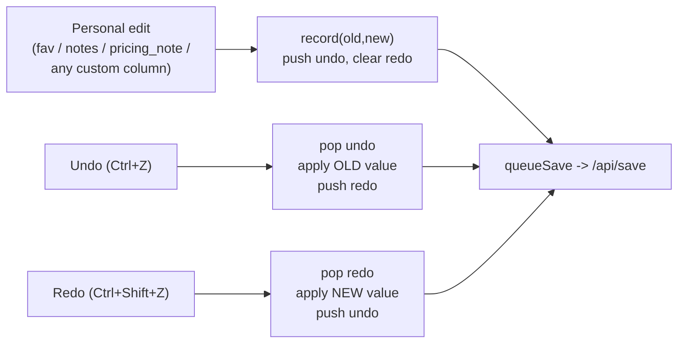

# Design (UI / CSS / JS)

Frontend design choices for ModelsDB's single-page table UI. For backend and data design see [ARCHITECTURE.md](ARCHITECTURE.md). For setup and usage see [README.md](README.md).

## Stack and why

The UI is **jQuery + DataTables**. Both are bundled and embedded in the Go binary (under `internal/app/static/`). There is no build step, no npm runtime dependency, and no CDN. The whole UI is one `index.html` plus `app.js`. For a single-user, data-table-centric tool this is far simpler than an SPA framework, and it keeps the "one self-contained binary" promise. The few multi-value filters use a small hand-rolled checkbox dropdown (see Filters) rather than a tag-widget library.

jQuery type hints in an editor are optional. If you want them, add a local `jsconfig.json` and `@types/jquery` (through a `package.json`). They are editor-only, not runtime dependencies, so the repo does not ship them.

## Typography

The UI uses **one font family and three text sizes**, defined as CSS custom
properties on `:root` so nothing hard-codes a `rem`/`px` text size.

- **One family.** Everything is set in `--font-ui` (a system-UI stack). The single
  exception is **monospace**, used only for the details-modal JSON (`#modal-json`)
  and preformatted blocks (`pre`), via `--font-mono`. Textareas inherit the UI
  family.
- **Three size roles**, each a plain multiple of the root font size:
  - `--fs-title` (`1.7rem`) - the `h1` only.
  - `--fs-control` (`0.95rem`) - every button and every input/select (filter
    controls, the inline custom-column dropdowns/text inputs, the note textareas,
    the DataTables page-length select, etc.).
  - `--fs-body` (`1rem`) - everything else: table cells, card text, the info line,
    tooltips, dialog copy, the version label.
  - The uppercase card micro-captions use `calc(var(--fs-body) * 0.72)` and the
    price unit `calc(var(--fs-body) * 0.78)` - derived sizes, not extra tokens.
- **The root font size is the one knob.** `html { font-size: 87.5% }` is 14px on a
  default 16px base, and because `--fs-body` is exactly `1rem` and every table
  dimension is `rem`, the table's width is proportional to that one number - which is
  what puts the table's `min-content` at ~1.4k px and therefore sets the breakpoint
  (see **Table vs cards**). It stays a **percentage**, never `px`, so a reader who has
  raised their browser's base size keeps that preference and the whole scale moves
  with them.
- **No role may depend on `vw` or carry a `clamp()`.** The root size is chosen to fit
  the table; a `vw` term would size text against the window instead of against that,
  and the two would fight.
- **Card view redefines only `--fs-body`**, to `1.15rem` inside the card media query.
  Card copy is larger than table copy because the root size is set small enough to fit
  a wide table and there is no table to fit here. It keeps the **same token name**, so
  every card selector that resolves `var(--fs-body)` picks it up with no other change.

Table dimensions - cell padding, column widths, the inline selects, the price pills -
are in `rem`, so they track the root size rather than standing still while the text
changes size around them. Borders stay in `px`: a hairline must not scale into a
blurry multi-pixel line. Icon and glyph sizes (the modal close `x`, the favourite
star, capability emoji, the status dot, the note badges) are sized independently of
the text roles, since they scale a mark, not copy.

## Table

The table is built from a single **`colConfig`** array in `app.js`. Each column declares a `title` and a `target` (the model field). You add or reorder columns by editing that array. Cell rendering and filtering look columns up by `target`, never by a hard-coded index, so nothing breaks when the layout changes.

**Reordering columns:** drag any column header onto another to move it there. The new order is saved server-side (`col_order` in `/api/settings`, a list of `target` names) and the page reloads to rebuild the table in that order. The reorder works by rearranging the `colConfig` array itself, so every `target`-based lookup stays correct with no other change. Because the array order changes, the saved **sort** order is stored by `target` name too (not by numeric index), so a reorder can never leave the sort pointing at the wrong column.

**Showing / hiding columns:** a **Columns** dropdown in the filter bar lists one checkbox per column. Unchecking a box hides that column via DataTables `column().visible()`; all columns start visible. The hidden set persists server-side as `col_hidden` in `/api/settings` (a list of `target` names - the complement of the checked boxes, stored as the *hidden* set so a column added in a later build defaults to visible). It is applied on load alongside `col_order`, so visibility and drag-order are independent and both survive a reload. Because a hidden column's cells are dropped from the DOM, the column also disappears from the mobile cards (expected). All cell lookups are by `data-col` attribute (never by DOM position), so a hidden column never shifts another column's reads.

**Sorting:** numeric and categorical columns carry a `data-dt-order` attribute, so DataTables sorts by real value instead of rendered text. Prices sort by number, a dropdown-type custom column by its option's position (unset always sorts last - see **Custom columns** below), a text-type custom column alphabetically. Context sorts by its raw token count even though the cell renders a rounded `128k`. Every column is sortable; a field that has no column of its own (the HuggingFace and OpenRouter links, the personal note, the favourite star, ZDR, the pricing unit) is not sortable, because there is no column header to sort it by - each of those is filterable instead (the favourite via `#f_fav`).

**Cell alignment:** every desktop cell - header and body - is **left-aligned** (`text-align: left`, `!important` on the body to beat DataTables' automatic right-align of numeric columns and centring of icon columns). Desktop data cells are also vertically centered (`vertical-align: middle`), so a multi-line name cell (name plus the capability-icon row beneath it) and every custom column's inline dropdown/text control all sit centered within their row.

### The Name cell

The Name cell holds several fields that used to have columns of their own. Each was
one glyph wide, so a whole column - header, padding, and a share of the table's
minimum width - was being spent to show a mark that belongs next to the thing it
describes. The cell is built from three parts:

1. **the model name, then the date** (`.name-line`). The name is the click target
   that opens the **Details** modal (the raw model JSON rides in a `data-json`
   attribute on the name span). It is a `role="button"`, `tabindex="0"` element, so it
   opens by click or by keyboard (Enter/Space), and it underlines on hover/focus to
   signal it is interactive. The name does **not** navigate anywhere. The date also
   keeps its own sortable column, so the copy here (`.card-date`) is hidden on desktop
   and shown on a card.
2. **the icon row** (`.meta-line`): the capability icons, then the **HuggingFace**
   link (`.hf-link`, only for models with an `hf_slug`), the **OpenRouter** page link
   (`.or-link`, only for models with an `id`), the **copy-id** icon (also `id`-only)
   that copies the model id (e.g. `anthropic/claude-haiku-4.5`) via the shared
   `copyText` helper (with the non-secure-origin fallback), flashing a check glyph on
   success, the **note** icon that opens the personal note, and finally the
   **favourite star** (`.fav-star`) - the row's only control, so it sits last.
3. **the personal note** (`notes`, `.name-note`), when the model has one.

**The desktop table and the mobile card lay these three out differently, and it is
the same DOM either way:**

- **Desktop: three stacked lines** - name+date, then the icon row, then the note. The
  icon row never wraps (a wrapped mark row reads as a second, meaningless line); the
  name and the note do. A name too long for the column breaks onto another line rather
  than being truncated (a clipped name is unreadable). The date follows the name in
  the **same inline flow** - which is why `.tooltip` is `display: inline` inside
  `.name-line` rather than the `inline-block` it is elsewhere (an inline-block is an
  atomic box, so a wrapped name would take the full column width and shove the date
  onto its own line). The date carries `white-space: nowrap`, so it never breaks apart.
- **Card: name+date and the icon row share ONE line**, the icons trailing the title;
  the note keeps its own line below. In the media query `.name-line` becomes `inline`
  and `.meta-line` becomes `inline-flex`, so the icon row flows straight after the
  date. Because it is one inline-flex box, a name that wraps to several lines leaves
  the icons after its last word, and the whole icon cluster drops to the next line
  only when the title + icons genuinely do not fit - "wrap only if it must". The note
  (`.name-note`) stays a block, so it is always the line below.

**Context display:** the Context cell renders a rounded thousands value with a `k` suffix (e.g. `128000` -> `128k`) in both the desktop table and the mobile cards, while sorting stays on the raw number. The header carries a `title` tooltip, "Context size in thousands".

**Column widths:** the table is `table-layout: auto` and fills the width (`autoWidth: false, width: '100%'`). Every column sizes to its content, with two deliberate exceptions:

- **Name** is capped at `20rem` (`col-name` class) - long model names rendered with no width limit ballooned a single column past `~540px` and pushed the whole table past the viewport - with a **`16rem` min-width**, the floor it may be squeezed to. That number is measured, not guessed: across the 440-model catalog, `16rem` keeps **98%** of "name + date" inside two lines. `14.9rem` gets 96%, and reaching 100% needs `20.6rem` - 64px more table width to save nine models one line each.
- **Every dropdown-type custom column** carries no column width at all. Each `<select>` is `width: max-content`, so it sizes to its own widest option; a shared fixed width would hold the column open wider than anything in it needed.

Widths live in the stylesheet, never in `columnDefs`: DataTables renders `columnDefs.width` into a `<colgroup><col style="width:...">` in `px`, which would not track the text size.

## Inline editing

Curated fields are edited in place and saved automatically. There is no form and no save button.

- **Favorite:** a star toggle. It has no column of its own - it is the last mark on **line 2 of the Name cell** (after the note icon), the only control on that row of otherwise-links. Clicking or keying it (Enter/Space) flips `data-fav` and saves. It writes **no** `data-dt-order`: the star lives in the Name cell, whose sort text is the model name, so stamping an order there would sort Name by favourite. The favourite is reached by the `#f_fav` filter instead of a sort.
- **Custom columns** (personal, user-defined - see **Custom columns management** below for how you create and delete one): every column renders from its own definition (`{id, name, type, options}`, fetched once from `GET /api/custom-columns` before the table is built) rather than a hardcoded field name, so the table has no fixed limit on how many you add. A **dropdown** type (`dropdown_text` or `dropdown_number`) renders a small `<select>` (class `.cc-select`, one shared look for every dropdown column) of the column's own options, unset showing an em-dash, used in **both** the desktop table and the mobile cards. **No custom column carries any colour of its own.** A **text** type renders a click-to-edit cell (class `.cc-text-display`/`.cc-text-input`) modeled on the personal `notes` field below: a display span swaps to a single-line `<input>` on click and back on blur/Enter. Sorting: a dropdown sorts by its option's position (`data-dt-order`, unset always last, whatever the option count); text sorts alphabetically on the same attribute, kept in sync with the cell's text on every edit. Every custom column carries the shared `.cc-cell` class, which drives its card-view spacing and label (see **Card layout** below) with no per-column CSS.
- **Notes (`notes`, personal):** click-to-edit text on the **third line of the Name
  cell**. A display span swaps to a `<textarea>` on click and back on blur/Enter.
  The line **collapses while the note is empty** (CSS `:has(.notes-placeholder)`), so
  a note-less model costs no height; the **note icon on line 2** (`.notes-edit`, a
  speech-bubble `NOTE_ICON`, faint when empty and orange when set) is the way in to
  write a first note. Both routes run the same `openNoteEditor()`. Because the line
  is revealed by the textarea replacing the placeholder, the editor forces a style
  recalc before focusing - `focus()` on a node the browser still has as
  `display: none` does nothing, and the user would lose their first keystrokes.
- **Pricing note (`pricing_note`, objective):** a caveat about pricing SKUs the In $/Out $ columns omit. It rides as a small badge (`.pnote-icon`) beside the unit under **both** the In $ and the Out $ price. There is **one note per model**, so both badges show it and either one edits it; `setPnoteBadges()` writes every badge in the row at once, so the two can never disagree. A model that HAS a note shows a bold orange **note-document icon** (an inline `currentColor` SVG, `PNOTE_ICON`) that is always visible, so noted rows stand out at a glance. A model without one shows a faint **note-with-plus icon** (`PNOTE_ADD_ICON`) that appears only while its price cell is hovered, so the add-a-note affordance is there without cluttering every row. On a mobile card there is no hover, so the icon is **visible at rest** and tappable: the empty state is just that same muted note glyph (no box, no fill - the same mark the desktop reveals on hover), and the has-note state stays the round orange dot. Hovering (desktop) or tapping (mobile) opens the same flow - a read-only tip (`#pnote-tip`) on hover, and a small pinned editor (`#pnote-modal`) with a `<textarea>` and a Save button on click/tap. The editor stays open until you click outside it (so the text can be selected), and any change is saved on close. The note text lives in the badge's `data-pnote` attribute; `queueSave` reads it from there.

`notes` and `pricing_note` are **different fields and stay separate**: `notes` is
personal and never leaves the database, `pricing_note` is objective and is published
in the exported catalog. They are two different marks on two different cells, so they
never sit side by side.

**Unit (`measurement`)** is NOT editable. It is derived at import and rendered
read-only as a short abbreviation under each price (see **Visual cues**). You can
filter it from the header and set its colors from the Colors panel.

- **OpenRouter link:** a link, not editable data, on line 2 of the Name cell. It renders OpenRouter's official **brand glyph** (their v2 mark, `OR_ICON`, inlined verbatim so the app stays self-contained) only for models that carry an OpenRouter `id` - source `openrouter` or `collection`. HuggingFace-direct and manual models have no `id`, so they show no logo. Unlike the other name-row marks (which stroke in `currentColor`), the glyph is **filled with the OpenRouter brand colour**, `--or-fill` - purple (`#7624F4`) in light, lime (`#C8FF00`) in dark, the two official variants - keyed off `data-theme` like every other themed colour. The path carries no `fill`; CSS drives it, and the glyph is sized by height (`0.95rem`) with `width: auto` so its 401.4:293.7 aspect ratio never distorts. The `.or-link` anchor opens that model's OpenRouter page - `https://openrouter.ai/<slug>` - in a new tab. This icon is the only OpenRouter-page link (the name opens the Details modal instead). Embedding the brand glyph here is nominative use - the icon links to that model's page on OpenRouter.

## Custom columns management

A **Custom columns** button sits in the filter bar next to **Columns**, following that same pattern (a button that opens a small dialog) rather than inventing a new one - it reuses the **Colors** panel's modal skeleton (`#color-modal-content` etc.) under its own ids (`#cc-manage-modal`/`#cc-manage-content`).

The dialog lists every existing column (name + type) with a **Delete** button, and a form to add one: a name field, a type select (Text / Dropdown (text values) / Dropdown (number labels)), and - for either dropdown type only - a textarea for the allowed values, **one per line, in the order they should appear** (that line order becomes the column's fixed display order; there is no separate reorder control). The textarea is hidden for the Text type (`$('#cc-new-type').on('change', ...)` toggles it).

**Delete asks first, in plain words.** Clicking Delete opens a native `confirm()` naming the column and stating plainly that it **permanently erases every model's stored value for it** and **cannot be undone** - there is no soft-delete or trash, since the cascade at the database level is immediate and real.

**Create and delete both reload the page.** Either one changes the table's column *set*, not just a value, so - exactly like a column drag-reorder (`reorderColumns`) - there is no partial-rebuild path; the change is persisted through `POST`/`DELETE /api/custom-columns` and the page reloads, which rebuilds `colConfig` from the fresh column list deterministically.

## Saving

Edits are pushed to an in-memory **queue, debounced ~0.5s**, then POSTed to `/api/save` as one batch. The most recent edit per model wins.

A failed save is **retried up to 12 times** with a short delay, surfacing a status message, before giving up.

A small indicator reflects state (saving / saved / offline). A periodic `/api/health` ping shows DB connectivity.

## Undo / redo (session-only)

Every personal data edit can be undone and redone from two buttons at the start
of the filter row (**Undo** / **Redo**), or with the keyboard (`Ctrl`/`Cmd`+`Z`
to undo, `Ctrl`/`Cmd`+`Shift`+`Z` or `Ctrl`+`Y` to redo). This covers the three
fixed personal fields - **favorite, notes, pricing_note** - plus **any custom
column's value**, whatever number of them exist. Filters, sort order, column
show/hide, column order, colour thresholds and theme are **not** part of this
history.

**Session-only, in memory.** The history is a plain pair of arrays (an undo stack
and a redo stack) held in the page by a small self-contained module, `editHistory`
in `app.js`. It is **not** persisted - a page reload or a server restart starts
with both stacks empty and both buttons disabled. There is no history table in the
database and no change to what `/api/save` stores.

**How it records.** Each edit handler, right after it applies the change to the
cell and just before (or alongside) its `queueSave`, calls
`editHistory.record(name, field, oldValue, newValue)`. The `name` is the model's
`data-name` (the same key the save path uses). `field` is a fixed name
(`'favorite'`, `'notes'`, `'pricing_note'`) for the three fixed fields, or
`'custom:<column id>'` for a custom column - one generic branch in `applyField`
handles every custom column by looking its type up in `customColumnsById`, so a
new custom column needs no new branch of its own.
The *old* value is captured **before** the edit is applied: the favorite toggle
reads the star's prior `data-fav`; the click-to-edit notes (and, identically, a
text-type custom column) stash their pre-edit text on the input (`data-orig`) and
the commit handler reads it back; a dropdown-type custom column's `<select>`
records its committed value at render time in `data-prev`, refreshed after each
change, so the change handler always knows the value it held before; the
pricing-note editor compares the textarea against the badge's prior `data-pnote`.
A record with no real change (old equals new) is dropped. Committing a fresh edit
**clears the redo stack**.

**How it restores.** `undo()` pops the undo stack, re-applies the record's *old*
value, and pushes the record onto the redo stack; `redo()` is the mirror image (pop
redo, apply the *new* value, push onto undo). Restoring drives the **same**
cell-apply + `queueSave` path a manual re-edit uses, so the database always matches
the visible cell - a dropdown field is restored by setting the control's value and
firing its own `change` handler (which does the `data-dt-order` bookkeeping and the
save); favorite, notes, a text-type custom column, and the pricing-note badge are
rewritten directly and saved. A re-entrancy flag (`applying`) is raised for the
duration of a restore so the edit handlers it triggers do **not** record a new
history entry - one restore is one move, never a new edit.

**Buttons.** Undo is disabled when the undo stack is empty; Redo is disabled when the
redo stack is empty; both refresh on every edit, undo and redo. They sit in the filter
row (so they ride into the mobile filter drawer with the other controls) but are not
filters - clicking them never touches the saved filter state.



## Filters

A filter bar sits above the table. It has full-text search (name/notes/description), fixed-size summary multiselects for input/output modalities and year, simple selects for HF-link/OpenRouter/thinking/tool/MoE/notes/ZDR/Unit and a Favorites-only toggle, numeric inputs for min context, max in/out price, min (active) params, and max on-disk size (GB), and one filter per custom column (see **Custom-column filters** below). The max-size filter keeps rows that have no recorded size, sorting them to the bottom. A **Columns** dropdown (see the Table section) and a **Custom columns** button (see **Custom columns management** above) sit in the same bar.

### Custom-column filters

Every custom column gets its own filter control, generated automatically - there is no fixed set to hardcode in `index.html`, since columns are created and deleted at runtime. `app.js`'s `buildCustomColumnFilters()` builds one control per entry in `customColumns` (the same array fetched from `GET /api/custom-columns` that extends `colConfig`) into `#cc-filters`, a wrapper that sits in the filter bar right after the **Unit** filter and before **Colors**. The wrapper is `display: contents` (`style.css`), so its generated children become direct flex items of `.filters-row` exactly like every other filter control, instead of stacking inside a nested block.

- **Dropdown-type** (`dropdown_text`/`dropdown_number`): a `<select id="f_custom_<id>" class="filter-select-sm">` wrapped in a `.filters-label`, offering **All** plus each of the column's own option values in their defined order - the same shape the old fixed `f_speed`/`f_ocr` single-selects had before this feature replaced them, minus their emoji (a user-defined column has none).
- **Text-type**: a plain `<input id="f_custom_<id>" class="filter-input">`, matching `#f_search`'s bare-input look, that substring-matches case-insensitively.

Both read the row's committed value the same way every other custom-column code path does: the dropdown reads the row's own `.cc-select[data-col-id]` control (the same element `queueSave` reads), and the text filter calls the shared `rowCustomTextValue()` helper (the same one `queueSave` and `editHistory` already use) - so there is one definition of "this row's value" for a custom column, not a second one for filtering. Every control is wired into the same `$.fn.dataTable.ext.search.push` predicate the fixed filters use, AND-combined with all of them, so a custom-column filter narrows the table together with search/year/etc. exactly like any other filter. If a custom column's table column is currently hidden (via **Columns**), its cell is not in the DOM, so its filter has nothing to read and is silently inert for that column until it is shown again - the same behavior documented above for any filter that reads a cell rather than a row attribute.

**Rebuild on column create/delete.** Because creating or deleting a custom column already reloads the page (see **Custom columns management** above), `buildCustomColumnFilters()` simply re-runs on that reload and produces the current column set's filters - no live add/remove path was needed.

**Persistence.** Each control's value is saved and restored via its own `f_custom_<id>` key in `/api/settings` (an opaque JSON blob the server just stores, so a per-column key needs no server-side change), alongside the fixed `f_*` keys. The **Clear** button resets it the same way it resets every other filter, since it targets filter controls by their generic `input`/`select` tag inside the filter bar rather than by a fixed id list.

**One line, Clear last.** All filter controls live in a single flex row (`.filters-row`) that wraps only as an overflow fallback - there is no forced second row. The **Clear** button is the last control in the row, after every filter and the Colors/Columns controls; clicking it empties every filter (keeping the colour thresholds) and resets the sort.

**Summary multiselects (Input / Output / Year).** These three are multi-value filters, but their closed control must never grow with the number of selections. Each stays a hidden native `<select multiple>` (still the single source of truth, so `$('#id').val()`, the search reads, and the `saveFilters`/`loadFilters` persistence are all unchanged), with a hand-rolled control over it: a **fixed-width button** whose label summarises the state - the field name (`Input`, `Output`, `Year`) when nothing is picked, the single value when exactly one is picked, or the literal `Multiple selected` for two or more - and a **dropdown panel of checkboxes** (`.cdd`, built in `buildCheckDropdown`). The button width is capped near the width of "Multiple selected" and clips with an ellipsis, so height and width stay stable regardless of the selection count. Toggling a checkbox writes the hidden select's value and fires its `change` event, so filtering and saving run exactly as they would for a plain select; a programmatic change (a `loadFilters` restore or Clear) re-syncs the checkboxes and the summary from the select. The panel reuses the Columns-dropdown look, so light/dark theming is shared, and it works by tap in the mobile filter drawer (where it renders inline and full-width).

**Every filter reads the data where it is rendered, and a field having no column of
its own changes nothing about that.** Two presence filters mirror each other by
testing for a link on line 2 of the **Name** cell: **HF-link** (`#f_hf`, the
`.hf-link` anchor) and **OpenRouter** (`#f_or`, the `.or-link` anchor). **Notes**
(`#f_has_notes`) reads the note on line 3 of the same cell, via the shared
`rowNoteText()` helper - which is also what the full-text search and the save path
use, so there is one definition of "this row's note". The **Favorites** filter
(`#f_fav`, "Favorites only") keeps only rows whose Name cell carries a set star
(`td[data-col="name"] .fav-star.is-fav`) - the star has no cell of its own, so this,
not a sort, is how the favourite is surfaced.

Some row facts are not rendered as text anywhere, so they ride on the `<tr>` as data
attributes and the filters read them there: `data-reasoning`, `data-tool`,
`data-moe`, `data-zdr`, and `data-meas` (the **raw** pricing unit, e.g.
`per 1M tokens`, of which the price cells show only the abbreviation). A row
attribute is also the only source that survives **column hiding** - a filter reading
a cell stops working when the user hides that column, while a row attribute does not.

Filter state is **persisted** server-side via `/api/settings`, so it survives reloads and restarts.

**Model counter.** A small "N of M" counter shows how many models are currently displayed against the total (e.g. `192 of 441`). It is **two elements kept in sync**, one per layout: `#model-count` in the desktop filter bar (after **Clear**) and `#model-count-m` in the mobile sort bar (just left of the **Sort** label); CSS shows whichever belongs to the current viewport. Both are written together by `updateModelCount()`, which reads DataTables' own `page.info()` - `recordsDisplay` (the filtered/searched count) over `recordsTotal` (every loaded row), the **same source that feeds the `.dt-info` line** - so the counter can never drift from the table. It is wired to `draw.dt`, which fires on every filter, search, sort, paging and column-visibility change, so it stays live with no second trigger.

## Visual cues

**Price cells (In $/Out $)** carry the price for every model. This covers per-token figures and per-second/image/etc. prices alike. Each cell is color-coded green/amber/red by two **per-measurement thresholds**, compared against the number as displayed. The thresholds are editable from the header **Colors** panel and persisted with the other filter state via `/api/settings`. Defaults live in `DEFAULT_COLOR_RANGES` in `app.js`.

**The pricing unit rides under the price**, on its own line, **abbreviated** (`.price-unit`), with the pricing-note badge beside it. The stored values are long - `per 1M tokens` - and a price column cannot carry that much text, so `unitAbbrev()` maps each to three or four characters and the full text goes on the cell's `title`:

| stored `measurement` | shown |
|---|---|
| `per 1M tokens` | `tkn` |
| `per 1M characters` | `chr` |
| `per image` | `img` |
| `per second` | `sec` |
| `per minute` | `min` |
| `per hour` | `hr` |
| `per megapixel` | `mpx` |
| `per search` | `srch` |
| (empty) | (nothing) |

A unit that is **not** in that map falls through to its **raw text** rather than vanishing: upstream can add a unit at any time, and a wrong-looking label is recoverable where a silently dropped one is not. Note that `tkn`/`chr` drop the "1M" while `sec`/`img` are per-1, so the two kinds of number are not comparable at a glance.

**Capability icons** mark reasoning, tool use, MoE, and Zero Data Retention. They lead the Name cell's **icon row** (`.meta-line`) in both views - a separate line under the name on desktop, trailing the name+date inline on a card. ZDR has no column - the lock icon is how a zero-retention model is marked, and `#f_zdr` filters it from the row's `data-zdr`.

A sticky header keeps columns labeled while scrolling.

## Paths dialog & update banner

**Paths dialog (`#paths-modal`):** a small round **i** (info) button next to **Update** in the header opens a read-only dialog. It lists where this instance keeps its files: the config/data/cache dirs plus the key files (`modelsdb.db`, `curated.json`, logs, backups, etc.). It fetches `GET /api/paths` on open. Use it to find your data so you can back it up (copy `modelsdb.db`) or relocate it. The top of the dialog also carries one-click **Claude / ChatGPT** links that ask either AI whether the app is safe, for cautious users.

**Update banner (`#update-banner`):** a dismissible strip below the header, shown only when `GET /api/update-check` reports a newer release. The download link is built as a real DOM `<a>` (not string-interpolated), so the upstream URL can't inject markup. This is notify-only. There is no in-app update action.

**Version label (`#app-version`):** the installed version sits next to the title (`dev` for `go run` builds).

## Theming (light / dark)

The UI ships a **light** theme (the default) and a **dark** theme, toggled by a
sun/moon button in the header next to the GitHub icon. A moon shows in light mode
(click to go dark); a sun shows in dark mode (click to go light). The glyph swap is
pure CSS, keyed off a `data-theme` attribute on the `<html>` element.

**How it works.** Every chrome colour in `style.css` is a CSS custom property
defined in `:root` (light values) and overridden in a `:root[data-theme="dark"]`
block, so one attribute flip repaints the whole page with no per-element JS. Only
*chrome* is themed (backgrounds, text, borders, the filter bar, modals, tooltips,
and the bundled DataTables controls). **Semantic colours are deliberately
not themed** - the price green/amber/red, the gold favorite star, and the HF
brand colours carry meaning and read fine on both backgrounds. No custom column
carries a colour of its own, so every `.cc-select` option just inherits the
normal themed control colours, needing no special-case override. The dark block also sets
`color-scheme: dark` so native control pop-ups, the caret, and scrollbars follow
the theme.

**Persistence is `localStorage`, not the server.** Unlike the filter/column state
(saved via `/api/settings`), the theme is stored per-device in `localStorage` and
applied by a tiny inline script in the `<head>` **before any CSS paints**. Server
settings arrive from an async fetch *after* the first render, which would flash the
wrong theme on load; a synchronous, pre-paint source is required to avoid that. With
no saved choice, the script follows the OS `prefers-color-scheme`. `app.js` only
handles the manual toggle and writes the choice back to `localStorage`.

## Table vs cards: one breakpoint

**There is exactly one breakpoint: `max-width: 1299px`.** Above it the page renders
the table; at or below it, each row becomes a card. `app.js` matches the **same
query** (`window.matchMedia('(max-width: 1299px)')`) to pick the page length, so the
layout and the paging cannot disagree - card view pages **25 rows**, table view lists
them all (`-1`). `applyViewPaging()` also listens for the query's `change` event, so
a resize across the boundary re-pages live.

**Why 1300.** The breakpoint tracks where the table stops fitting, measured. At the
root size the table's `min-content` is ~1.15k px, so at 1300px the table has ~60px to
spare and below ~1250px it would have to scroll sideways. The root size
(`html { font-size: 87.5% }`) is the knob that sets that width: every table dimension
is `rem`, so the table's width is proportional to it. Removing the Favorite column
(its star now lives in the Name cell) cut ~60px off the min-content, which is what let
the breakpoint come down this far.

Nothing below 1299px needs a second query: the card itself absorbs that whole range,
because its cells re-pack to whatever width they are given (see **Card layout**,
below).

A `<meta name="viewport" content="width=device-width, initial-scale=1">` in the
`<head>` makes a phone use its real (device) width as the layout width; without it a
mobile browser assumes a ~980px page and the query would be tested against a fiction.

There is **no second render path**: the card layout is a pure-CSS skin over the one
`<table id="models">` DataTable. The same DOM, the same `colConfig`, and the same
filter/sort/save handlers drive both layouts, so nothing about the data flow changes.

### Card layout

Inside the media query the `<thead>` is hidden and each `<tr>` becomes a bordered
**card**. **The card has no columns.** It is a wrapping flex line: every cell is a
block that flows next to its neighbours, grows to absorb the leftover space on its
line, and stops at its own content width.

```css
#models tbody tr { display: flex; flex-wrap: wrap; align-items: stretch; gap: 10px 14px; }
#models tbody td { flex: 1 1 auto; max-width: max-content; min-width: 0; }
```

The `gap` (10px between rows, 14px between columns) is the general breathing room
between every cell. **Custom columns** (the shared `.cc-cell` class) need a touch
more, because several small controls side by side read as one clump: every such
cell adds `margin-inline: 8px`, and since flex `gap` and item margins **add**, two
adjacent controls end up ~30px apart (14px gap + 8px + 8px) - visibly looser than
the rest, with the cells' zero padding untouched so they all stay the same height.
This applies uniformly to any number of custom columns, not just a fixed three.

Three declarations carry the design, and each is load-bearing:

- **`flex-wrap: wrap`** - cells spill onto a new line instead of squashing.
- **`flex: 1 1 auto`** - the basis is the cell's own content size, and `grow: 1` lets
  it take a share of whatever its line has spare.
- **`max-width: max-content`** - the ceiling. Without it, `grow` stretches the few
  cells on a short line (typically the **last** line) across the whole card. With it,
  a cell can never be wider than its content can use.

**Why not a grid.** Any grid - including `repeat(auto-fill, minmax(4.5rem,
max-content))` - defines **tracks**, and tracks are a fixed rhythm the cells must snap
to. A cell needing 50px still occupies a 4.5rem track, and whatever the last track
cannot use is stranded at the card's edge. Flex has no tracks: each cell is measured
on its own, so cells pack tighter and the space left at the end of a line is what
remains after real content, not after a grid step.

**Cells reflow; they are not pinned, and the card sets no `order` at all.** There is
no per-field placement, because there are no slots to place cells into. Cells flow in
document order, which is the desktop column order the user can drag; as the card
narrows they re-pack onto different lines. That is the point of the layout, and it is
why the card no longer guarantees a fixed row grouping.

**`align-items: stretch`** is what equalises heights. `align-items` positions items
within *their own flex line* (`align-content` is what distributes the lines), so each
line self-equalises: cells sharing a line share a top and a bottom edge, whatever
their content.

**The title line is the one exception.** The **Name** cell takes `flex-basis: 100%`,
so a flex line break falls right after it and it holds the whole first line alone -
name + date, the icon row (which ends with the favourite star), and the note, all
stacked inside that one cell. It is also the one cell that opts out of `max-width:
max-content`: it is the card's title and should hold the line, not shrink to its text.
Because the Name cell is **first in the DOM** (Favorite is no longer a column), the
title leads naturally and no `order` is needed to place it.

**Every caption sits on its own line above its value.** Inline, a caption and its
value compete for one content-sized cell: whichever runs out of room wraps and stands
taller than its neighbours, so the line stops reading as a line. Stacked, every value
starts at the same baseline whatever the text.

**The cells carry no fill of their own.** The bundled DataTables sheet stripes
alternate rows by painting each *cell* with an inset box-shadow
(`inset 0 0 0 9999px`), not the row. In a table that reads as one continuous stripe;
in a card, whose cells are separate blocks with gaps between them, it fragments into a
grey rectangle behind every cell. A card is one tile on one background and alternates
nothing, so the card block zeroes that shadow.

`data-col` (and `data-label`, `data-parch`) are inert on desktop - filtering and
sorting still read the cell's text and its `data-dt-order`, exactly as before.
Tapping the model name opens the Details modal (there is no separate Details
button); the name also carries the copy-id icon for OpenRouter-listed models.

A few cells are **captioned** in card mode: input, output, and every custom column
(via the shared `.cc-cell` class, so any number of them are captioned with no
per-column CSS) take a small upper-case label from their `data-label`, on its own
line above the value.
**CONTEXT**, **PARAMS**, **SIZE** and **IN** / **OUT** all take a literal upper-case
word from a CSS `::before` rendered on its own line **above** the value
(label-over-value) - so a price reads `IN` over `2 tkn [note]` exactly as Context
reads `CONTEXT` over `256k`. On the In/Out cells the abbreviated unit and the
pricing-note icon sit **inline after the price pill** (`.price-unit` is `inline-flex`
in the card), so the value, its unit and the note icon are one row under the caption.
Some values gain
**CSS-rendered suffixes** so the card needs no extra markup: params shows
its combined `B / <active>B` suffix (from a `data-parch` the renderer emits, or just
`B` when there is no active count), on-disk size gets a ` GB` suffix, and the date
(in the name cell) is wrapped in parentheses. **Empty cells collapse**
(`td:empty { display: none }`), so a model with no recorded size or notes simply
omits that slot instead of showing a blank line. The In $/Out $ price pills keep
their green/amber/red colouring.

**Card separation.** The page (body, top bar, and sort bar) sits on the **page
background** (`--bg` - light grey in light, near-black in dark) while each card sits
on the **card background** (`--card-bg` - white in light, slate in dark), so the
cards visibly separate from the page in both themes. Each card is further defined by
its own rounded border and a soft shadow, while the DataTables wrapper is flattened
(transparent, no shadow), giving a clean list of raised tiles.

**Sort + pager bar.** Because the header is hidden, a mobile-only
`#mobile-sortbar` sits under the top bar as a three-column grid: the **Filters**
button on the left, a **Sort** field select in the middle, and a direction toggle
button on the right. The select starts with a fixed set of common fields (Name,
Date, Context, Params, Size, In $, Out $) from `index.html`, and `app.js` appends
one `<option>` per custom column after fetching the column definitions - the same
pattern the `#f_year`/`#f_measurement` filters use to build their option lists
from live data - so every custom column is reachable from the mobile sort bar too.
The Filters button carries `margin-right: auto`, which pushes it to the left edge and
packs the rest into a right-hand cluster: the **model counter** (`#model-count-m`),
the Sort label, the select, and the direction button, in that order. The Sort select
itself is
`width: max-content` (capped at `max-width: 100%`), so it shrinks to its widest option
instead of stretching across the bar, while still never overflowing on a narrow
screen. The sort control drives the **same** `table.order()` a desktop header click
would, and fires the same `order.dt -> saveFilters` persistence - there is no second
sort path, and the saved order is shared with desktop. The field and direction are
seeded from the current saved order on load.

Nothing on a phone is sticky: the top bar, this sort bar, and the update banner all
scroll away with the page (a short screen has no room for a fixed bar).

**Pager and length layout.** The table uses the DataTables 2.x `layout` API (not the
legacy `dom` string): the info line, the pager, and the page-length control all sit
below the table (`bottomStart`/`bottom`/`bottomEnd`). On mobile the `.dt-container`
is a CSS grid that flattens the DataTables layout wrappers (`display: contents`) and
places these controls by area: "Showing 1 to 25 of N" on its own line, then the
pager at the left and "25 / page" at the right on the next line; the pager buttons
are enlarged for touch (40px targets). On desktop the same controls render in a row
with the info line at the left and the page-length control right-aligned.

**Compact pager.** A custom pager (`DataTable.ext.pager.mdbCompact`, selected via
`pagingType`) emits a short button sequence - previous, page 1, page 2, an ellipsis,
the last page, next - whenever there are more than four pages; with four or fewer
pages it lists every page. It reads the page count from the live table instance, so
it renders correctly from the first draw onward.

**Filter drawer.** A **Filters** button appears in the mobile sort bar on narrow
viewports only (`display: none` on desktop). It toggles a `filters-drawer-open`
class on `<body>`; the *same* filter bar is repositioned by a CSS `transform`
into an off-canvas sheet that slides in from the left over a dimmed backdrop.
Because it is only repositioned - never moved in the DOM - every filter binding and
the `saveFilters`/`loadFilters` persistence keep working untouched. Controls are
stacked and sized up for touch inside the drawer. The Input/Output/Year summary
multiselects render their checkbox panel **inline and full-width** inside the
drawer (instead of the floating panel used on desktop), so tapping the button
opens the checkboxes in the stacked filter column. A **close (X) button**
(`.filters-close`) is pinned sticky to the drawer's top-right corner; it exists only
in card view (`display: none` otherwise, so the desktop filter bar never shows it)
and drops the `filters-drawer-open` class exactly as tapping the backdrop does.

**The drawer transition avoids a breakpoint flash.** The slide transition lives on
the **open state only** (`body.filters-drawer-open .filters-container`), never on the
base `.filters-container`. If the base carried it, crossing the 1300px breakpoint -
where the media query first applies `transform: translateX(-100%)` - would animate the
drawer sliding off-screen on every desktop<->card resize. With the transition only on
the open state, entering card view places the drawer off-screen **instantly**, tapping
Filters **animates** it open, and closing it (the class is removed, so the
transition-less base rule takes over) is **instant**. Instant close is the deliberate
trade for a flash-free breakpoint with no JS driving the layout.

**Touch editing.** Every inline edit is a real click/tap handler, so the star,
every custom column's dropdown or click-to-edit text field, click-to-edit notes,
and the pricing-note modal all work by tap with no extra code. The pricing-note
icon needs a touch tweak: on desktop
its faint glyph only appears on cell hover, which a finger can never trigger, so in
card mode it is always visible - the empty state is just the muted note glyph (no
box), and both states carry transparent padding for a comfortable tap target - and a
tap opens the same `#pnote-modal`. That modal also closes on a tap outside it (a
`touchstart` mirror of the desktop `mousedown` close, gated so a single tap cannot
both open and close it).
The Name-cell hover description - a desktop-only preview - is dropped in card mode
(the same text is in the `Details` dialog).

**Details modal.** The dialog (`#modal-content`) is a flex column on every
viewport: a fixed head (the "Model Details" title, the close button, and - on
mobile - a Copy JSON button) over a scrolling JSON body, so the head never scrolls
out of view. On mobile it fills the screen (a `100vw`/`100vh` sheet with a small
margin) so long JSON is readable. The JSON body (`#modal-json`) is the scroll
region and wraps on **every** viewport (`white-space: pre-wrap; overflow-wrap:
anywhere; word-break: break-word`), so a long line never forces a horizontal
scroll on desktop or mobile.

**Modal close button.** The `x` that closes the dialog (`#modal-close`) is
positioned `absolute` in the modal's **top-right corner** (`#modal-content` is
`position: relative`), with a 32x32 hit area, a muted colour that fills in on
hover, and a `z-index` above the content. The head reserves right-edge padding so
the title never slides under it. Because the body scrolls under a fixed head, the
close stays pinned in the corner. It closes the modal on both desktop and mobile
and in both themes.

**Mobile Copy JSON.** The modal head also carries a **Copy JSON** button (hidden
on desktop) that copies the details text via the same `copyText` helper (with the
non-secure origin fallback), flashing "Copied".

**Card-view paging.** Table view lists every row at once ("All"); card view pages
**25 rows** with the compact custom pager described above. `applyViewPaging()` matches
the same `max-width: 1299px` query the card block is keyed on (see **Table vs cards**),
so one breakpoint drives both the layout and the paging.

The desktop sticky header (`top: 56px`, tied to the desktop top-bar height) is
neutralised inside the media query, since the header is hidden in card mode; the
desktop value is never touched.

## Conventions for changes

Plain ES + jQuery, no transpiler. Keep rendering `colConfig`-driven (look up by `target`, not index). When adding an editable column, follow the existing inline-edit + debounced-save pattern (render -> edit handler -> `queueSave`).

**`/api/save` is a partial update, and `queueSave` depends on that.** `store.SaveCurated` writes only the keys the payload carries and leaves every other curated field at its stored value. So a field whose control is not in the DOM - the Name column hidden, both price columns hidden, or a model with no price to hang the badge on - must have its key **omitted**, not sent as `""`. Sending `""` would not save "nothing"; it would delete the stored note. Any new field read from a cell has to make the same check. Custom columns follow the identical rule one level down: `queueSave` builds a `custom_values` object by checking each column's control is actually in the DOM before adding its entry, so a hidden custom column is left out of `custom_values` entirely rather than sent as an empty value that would clear it.

**Style with classes, not inline `style` attributes.** Cell appearance lives in
`style.css` as classes (e.g. `.price-cell`, `.cc-select`, `.cc-text-display`,
`.cap-*`, `.fav-star.is-fav`), so the theme tokens reach every element and dark
mode needs no per-element overrides. The one allowed inline style is a value that
is genuinely *continuous* and cannot be enumerated as a class: the In $/Out $
price pill sets only its `background-color` inline (a colour computed from the
per-measurement thresholds). Discrete states use a class instead.

**A new custom-column type follows the same generic path, not a new branch per
field.** `renderCell` switches on `c.custom` (present for every custom-column
entry in `colConfig`), not on a hardcoded target name; a new predefined type would
extend the two existing `c.custom.type` branches (dropdown vs. text) in
`renderCell`, the `.cc-select`/`change` and `.cc-text-input`/`blur|keydown`
handlers, and `editHistory`'s `'custom:'`-prefixed branch in `applyField` - never
a new hardcoded field name threaded separately through `colConfig`, `renderCell`,
`queueSave`, and `editHistory`.
