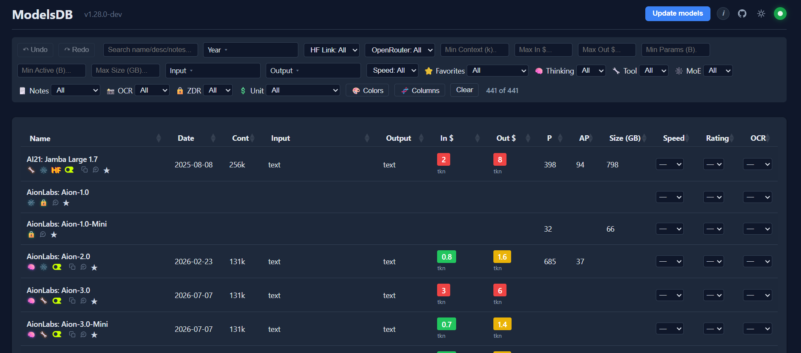

# ModelsDB

[](https://github.com/DavidTimar1/ModelsDB/actions/workflows/ci.yml)
[](https://github.com/DavidTimar1/ModelsDB/releases)
[](LICENSE)

A web application for browsing, rating, and annotating AI models. It is primarily built on the live model list from OpenRouter, and can be expanded with HuggingFace (via a Skill) or any other model source. It runs as a single self-contained Go binary that serves a local web UI.



## Background

This is a hobby project. I built it because I couldn't find an easy way to track the AI-model tests I run for other projects, and to get a clear, at-a-glance view of model costs and capabilities. I have limited time for it right now, but contributions are welcome. See [Contributing](#contributing).

## Is this safe?

Yes. ModelsDB runs entirely on your machine. It has no accounts, no telemetry, and no background server. It only reaches the network to fetch the public model catalog from OpenRouter (and, optionally, GitHub for the catalog and update check).

Don't just take my word for it. Paste this repo into an AI and ask:

- [Ask Claude](https://claude.ai/new?q=Is%20https%3A//github.com/DavidTimar1/ModelsDB%20safe%2C%20will%20it%20spy%20on%20me%2C%20will%20it%20put%20malware%20or%20virus%20on%20my%20computer%2C%20why%20is%20my%20computer%20alerting%20me%20when%20I%20want%20to%20run%20the%20exe%20file%3F)
- [Ask ChatGPT](https://chatgpt.com/?q=Is%20https%3A//github.com/DavidTimar1/ModelsDB%20safe%2C%20will%20it%20spy%20on%20me%2C%20will%20it%20put%20malware%20or%20virus%20on%20my%20computer%2C%20why%20is%20my%20computer%20alerting%20me%20when%20I%20want%20to%20run%20the%20exe%20file%3F)

**Why does my computer warn me about the .exe?** The binary is not code-signed (signing certificates cost money this hobby project doesn't spend). Windows SmartScreen and some antivirus tools flag any unsigned, less-common executable by default. You can read the full source here, build it yourself, or run it from source instead. To report a concern, see [SECURITY.md](SECURITY.md).

## Quick start

1. Download the latest binary from the [Releases page](https://github.com/DavidTimar1/ModelsDB/releases): `modelsdb.exe` for Windows, `modelsdb` for Linux.
2. Run it. On Windows, double-click `modelsdb.exe` (a console window stays open with the log). On Linux, run `chmod +x modelsdb && ./modelsdb`.
3. Open `http://127.0.0.1:8122` in your browser.

On first run the app seeds itself from a catalog **built into the binary**, so the table is populated immediately - no network fetch, no setup step. It then refreshes the live OpenRouter models in the background. You can re-run that refresh any time with the **Update models** button.

The app creates its own config, data, and cache folders automatically. You don't need to place anything next to the binary. To put those folders somewhere specific, see [Data locations & configuration](#data-locations--configuration).

### Running it in the background

When you start `modelsdb` in a terminal without a command, it shows a small menu:

```
ModelsDB 1.9.0  [stopped]  port 8122
  1) Start in background
  2) Stop background instance
  3) Start normally (foreground)
  4) Status / open in browser
  5) Update models now
  6) Add to PATH (run 'modelsdb' from anywhere)
  7) Quit
```

- **Start in background** keeps the server running after you close the terminal (or the console window on Windows), and hands the prompt back to you.
- **Stop background instance** shuts down a server started that way.
- **Add to PATH** makes the `modelsdb` command work from any terminal. On Linux/macOS you choose either a symlink into `~/.local/bin` or adding the binary's folder to your shell's PATH (it edits `~/.bashrc`, `~/.zshrc`, or `~/.profile` to match your shell); on Windows it adds the folder to your user PATH. Picking one method removes the other, and it only ever touches the entries it created. This takes effect in **new** terminals.

The same actions are available as commands, which is what you want in a script or a service:

```bash
modelsdb start     # start the server in the background, then return
modelsdb stop      # stop the background server
modelsdb status    # is it running? on which address?
modelsdb serve     # run in the foreground (what a service should call)
modelsdb --help    # list every command and global flag, then exit
modelsdb --version # print the version, then exit
```

`modelsdb --help` (or `-h`) prints the full list of commands and global flags; `modelsdb --version` (or `-v`) prints the version. Both exit without starting a server. An unrecognized command or flag is rejected with an error and a non-zero exit, so a typo can never accidentally start a server on the default directories.

The menu appears **only** when you run it interactively. A non-interactive start (from a service, a pipe, or `nohup modelsdb ... </dev/null`) starts the server directly, so nothing automated has to deal with the menu.

## Run from source

You don't need to build anything to try it. With [Go 1.26 or newer](https://go.dev/dl/) installed, run this from the project root:

```bash
go run ./cmd/modelsdb
```

As a shortcut, `./start_dev.sh` runs the server from source with no build step (pure source on `./data`, port 8123) in the foreground, so Ctrl-C stops it. To exercise the built binary instead, `./start_dev_binary.sh` runs `./dist/modelsdb` in the foreground on port 8124, pinned to `./data` and isolated from any production install. Those two share the same `./data` folder and PID file, so run only one at a time. `./start_dev_agent.sh` is separate: it pins its dirs to `./.temp-data` and runs on port 8125 with its own database, so it can run *alongside* the others without stopping them - useful when one person (or an agent) needs to restart the server while someone else is using theirs. Its database is seeded from the embedded catalog and holds no personal data; `./.temp-data` is git-ignored and safe to delete. For a shippable binary, use `./build.sh` (it writes `dist/modelsdb.exe` and `dist/modelsdb`).

Each script starts the server directly (no interactive menu) and binds this machine's Tailscale address alongside loopback, then prints that tailnet URL as the link to open - on a phone, or from another computer. **Prefer it over the `127.0.0.1` link when you are not on the machine running the server.** An editor with Remote-SSH (VS Code / Cursor) auto-forwards ports, and the local port number need not match the remote one: if its preferred local port is taken it silently uses the next free number, and old forwards keep listening after their remote process dies. A `127.0.0.1:8123` tab can therefore be wired to a different port - even a different server - than its number suggests. The tailnet URL has no forwarder in the path.

## What's in the catalog

The catalog starts from the OpenRouter API and is enriched to also cover model types the API does not return on its own, such as image, video, embedding, rerank, and speech models. Each model carries pricing, capabilities, and a Zero Data Retention (ZDR) flag, on top of which you layer your own notes, ratings, speed and OCR tags, and favorites. Your personal annotations live only in your local database and are never written to any shared file. For how all of this is fetched, stored, and derived, see [ARCHITECTURE.md](ARCHITECTURE.md).

## Refreshing data

This section is about pulling fresh model data into the app. A full refresh runs in three steps. The **Update models** button and the CLI run all three. A restart automatically runs only the first one (Catalog).

- **Catalog**: fetches the OpenRouter API and updates the database, including the ZDR (Zero Data Retention) flag. This runs automatically every time the app starts. See [ARCHITECTURE.md](ARCHITECTURE.md#zdr-derivation).
- **Collections**: scrapes the OpenRouter collection pages to add model types the API omits (image, video, speech-to-text, text-to-speech, embedding, rerank).
- **Pricing**: scrapes per-model pricing for those added models, where the unit varies (per image, per second, per megapixel, and so on).

The header **Update models** button runs all three in the background and shows progress, so a long-running instance can refresh without a restart. Each step is also available as a CLI command.

## Updating the app itself

This is different from refreshing data above: it replaces the **program binary**
with a newer release, in place.

When a newer release exists, a banner appears at the top of the page. On the
platforms the release publishes (Windows and Linux, both 64-bit Intel/AMD) the
banner offers **Update now**:

1. **Update now** downloads the new binary, verifies it, and swaps it in next to
   the running one. Nothing is applied yet.
2. **Restart to apply** re-launches the app into the new binary. The page shows a
   brief "reconnecting..." state and reloads once the new version answers.

The app never restarts on its own - applying an update is always your click.

**Automatic download (opt-in).** Open the small **i** (info) button in the header
and tick **Automatically download updates**. With it on, a newer release is
downloaded and verified in the background as soon as the daily check finds it, so
the banner is ready with **Restart to apply** without waiting. Downloading is
automatic; restarting is still your decision.

**Safety.** Every downloaded binary is verified before it is trusted: the release
publishes a signed checksums file, and the app checks that signature against a
public key built into the binary, then matches the download's SHA-256 against it.
If the signature or hash does not check out, the update is refused and your current
binary is left untouched. On any platform without a published asset, the banner
falls back to a plain download link.

## Data locations & configuration

ModelsDB keeps three kinds of files in separate, per-OS standard directories.

| Kind | What | Default location |
|---|---|---|
| **config** | `config.jsonc`, `settings.json` | `os.UserConfigDir()/modelsdb` (e.g. `%APPDATA%\modelsdb`, `~/.config/modelsdb`) |
| **data** | `modelsdb.db` (your data, including personal annotations), `curated.json` (public catalog export), `.backups/` | platform data dir (`%LOCALAPPDATA%\modelsdb\data`, `~/.local/share/modelsdb`, `~/Library/Application Support/modelsdb`) |
| **cache** | `logs/`, `modelsdb.pid`, `update-check.json` | `os.UserCacheDir()/modelsdb` |

These directory names are all lowercase `modelsdb` (the product is styled **ModelsDB** in the UI; the on-disk folders are not). A binary that previously created capitalized `ModelsDB` directories has their contents moved into the lowercase folders once, automatically, the next time it starts.

To put these folders where you want, drop a `config.jsonc` next to the binary (a legacy `config.json` is still read). The simplest version forces everything into the binary's own folder:

```jsonc
{
  "portable": true
}
```

Or point each folder somewhere specific (relative paths resolve from the `config.jsonc`'s own folder):

```jsonc
{
  "data_dir": ".",            // or an absolute path, or "data"
  "cache_dir": ".",           // omit a field to use the OS default for it
  "port": 8122,               // port to bind; omit to use the default
  "host": "127.0.0.1",        // bind address; omit to stay loopback (this machine only).
                              // "tailscale" auto-binds this machine's Tailscale 100.x IP
  "allow_public": false,      // required to bind 0.0.0.0 or a public address (off by default)
  "upstream": { "owner": "DavidTimar1", "repo": "ModelsDB", "branch": "main" }
}
```

`config.jsonc` is [JSONC](https://en.wikipedia.org/wiki/JSON#JSONC), so you can add `//` comments and trailing commas. The app writes a commented template the first time it runs. If you change folders for an already-running instance, stop it first (`modelsdb stop`, Ctrl-C its foreground window, or close the window).

The `upstream` block is the **fork switch**: point it at your own fork and the app pulls its catalog and update checks from there instead. See [ARCHITECTURE.md](ARCHITECTURE.md) for the full resolution order, the CLI flags, the environment-variable overrides, and the backup/restore commands.

## Query API

The server runs on a fixed port, bound to loopback by default, so other local apps and agents can query the catalog over HTTP. No auth, language-agnostic, no process to spawn.

> **Reaching it from another device.** By default the server listens only on `127.0.0.1` (this machine). To open it on another device — a laptop, a phone, another box on your [Tailscale](https://tailscale.com/) tailnet — set `host` in `config.jsonc`. The simplest value is `"tailscale"`: the app finds this machine's Tailscale `100.x` address itself and binds it (if Tailscale is down or not installed, it logs a warning and stays loopback-only). You can also set `host` to a specific address the other device can reach (a `100.x` IP from `tailscale ip -4`, or a LAN IP). The server keeps loopback bound as well, so local tools keep working. **There is no authentication:** anyone who can route to a non-loopback address you bind gets full read/write, including the endpoints that change data and replace the binary. So the server **refuses to bind a public or `0.0.0.0` address** by default — you must pass `--allow-public` (or set `"allow_public": true`, or `MODELSDB_ALLOW_PUBLIC=1`) to acknowledge the exposure. Prefer a private address (Tailscale/VPN/LAN) over a public one.

- `GET /api/models?<filters>` returns a JSON array of matching models.
- `GET /api` (no query string) returns a markdown usage guide written for an AI agent.
- `GET /api/health` returns status.
- `GET /api/paths` returns the on-disk locations this instance resolved at startup.
- `POST /api/update` starts a full refresh in the background and returns immediately.
- `GET /api/update/status` returns the current refresh state.
- `POST /api/app-update/apply` stages a newer app binary (download + verify + swap); `GET /api/app-update/status` reports staging state; `POST /api/app-update/restart` re-launches into a staged binary. These replace the program, not the data.

Filters are optional, AND-combined, and case-insensitive: `name`, `type`, `input`, `output`, `tool=yes`, `reasoning=yes`, `zdr=true|false`, `min_context`, `max_in`, `max_out`, and `fields=` for a projection. Use `all=1` to fetch everything.

```bash
curl 'http://127.0.0.1:8122/api/models?type=image&output=image'
curl 'http://127.0.0.1:8122/api/models?name=claude&fields=name,prompt,completion,context_length'
curl 'http://127.0.0.1:8122/api'   # the agent guide
```

Pricing note: `prompt` and `completion` are raw USD per token and are empty for non-token models like image, video, and audio. For those, read `price_display` instead.

## Building and releasing

`bash build.sh` produces `dist/modelsdb.exe` (Windows) and `dist/modelsdb` (Linux). Releases are built automatically by GitHub Actions when a maintainer pushes a `v*` tag that matches the `VERSION` file. See [CONTRIBUTING.md](CONTRIBUTING.md) for the contributor workflow.

### Self-update signing (one-time maintainer setup)

The in-app self-update only trusts a downloaded binary if the release's checksums
file is signed with the maintainer's key. Set this up once:

1. Generate a key pair:

   ```bash
   go run ./cmd/sign keygen
   ```

   It prints a **public** key and a **private** key (both base64). Neither is a
   password you reuse; the private key only signs releases.
2. Paste the **public** key into `internal/selfupdate/pubkey.go` as the value of
   `releasePubKeyB64`, and commit it. (Until this is a real key, self-update
   refuses by design.)
3. Add the **private** key as the GitHub repository secret **`MODELSDB_SIGN_KEY`**
   (Settings -> Secrets and variables -> Actions). Never commit it.
4. Cut a release as usual (push a `v*` tag). The workflow runs
   `go run ./cmd/sign sums dist/SHA256SUMS`, which writes `dist/SHA256SUMS.sig`,
   and uploads it alongside the binaries.

A fork that wants working self-update repeats these steps with its own key pair.
`cmd/sign` is a helper only; it is not part of the shipped binary and is not built
by `build.sh`.

## License

Licensed under the [MIT License](LICENSE). Free to use, copy, modify, and distribute, including commercially, provided the copyright notice is kept. Provided as-is, without warranty.

## Contributing

Contributions are welcome. See [CONTRIBUTING.md](CONTRIBUTING.md). Fork the repo, make your change, and open a pull request. To report a security concern, see [SECURITY.md](SECURITY.md).
